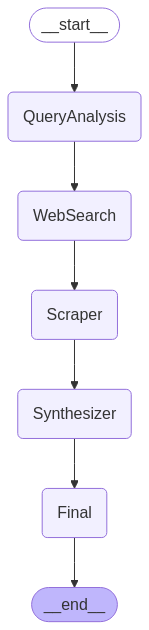

# Research Agent for Web Search

## Overview
This project involves creating a research agent that can process user queries by analyzing, searching, scraping, and synthesizing content from the web. The agent leverages multiple external tools, including Google Search API, web scraping, and OpenAI's LLMs, to generate useful research results, handle errors gracefully, and provide high-quality summaries.

## Features
- **Query Analysis**: The agent analyzes user queries to break them into subcomponents and generate optimized search terms.
- **Web Search**: The agent performs web searches using the SerpAPI to gather relevant information.
- **Web Scraping**: The agent scrapes relevant data from websites that allow it, extracting key content for synthesis.
- **Content Synthesis**: After gathering data, the agent synthesizes the information into a coherent summary, resolving contradictions and offering references.

## Step-by-Step Installation Guide

### Prerequisites
- Python 3.8+
- Streamlit
- OpenAI API Key
- SerpAPI Key
- Other Python dependencies listed below.

### 1. Clone the Repository
```bash
git clone https://github.com/kiruba11k/web-research-agent.git
cd research-agent
```

### 2. Set Up a Virtual Environment
```bash
python -m venv venv
source venv/bin/activate  # On Windows use `venv\Scripts\activate`
```
### 3. Install Required Dependencies
Make sure you have all the required libraries.

```bash
pip install -r requirements.txt
```

### 4. Set Up API Keys
Add your API keys in .env
```
GROQ_API_KEY = "your_openai_api_key"
SERPAPI_KEY = "your_serpapi_key"
```
### 5. Run locally
Once the agent is set up, you can run the app using Streamlit:
```
streamlit run app.py
```
## Agent Structure
The agent follows a modular structure, with several nodes defined for different tasks:

- **Query Analysis:** This node processes the user's query to identify the intent and generates optimized search terms. It uses OpenAI's LLM for analyzing the query.

- **Web Search:** This node performs web searches using the SerpAPI, leveraging the optimized search terms from the query analysis.

- **Web Scraping:** This node scrapes content from the websites obtained through the web search, adhering to robots.txt to respect scraping rules.

- **Content Synthesis:** This node combines the content scraped from multiple sources and generates a human-readable summary using LLMs.

- **Final Output:** Displays the synthesized summary to the user.

## How It Works
### Query Analysis (LLM)
- **Input:** User's query

- **Output:**

- Query intent
- Subcomponents
- Optimized search terms

- **How it's used:** Guides the Web Search stage to find more precise results.

### Web Search (SerpAPI)
- **Input:** Optimized search terms

- **Output:** List of URLs and search result snippets

- **How it's used:** Selects relevant sources to scrape for content.

### Web Scraping (BeautifulSoup)
- **Input:** URLs from the web search

- **Output:** Raw extracted website content
- **How it's used:** Collects material for the content synthesis phase.

### Content Synthesis (OpenAI LLM)
- **Input:** Scraped content from multiple websites

- **Output:** Human-readable synthesized summary

- **How it's used:** Provides final answer to the user, including references.

## Flow Diagram


## Live Demo
[Visit](https://mywebresearchagent.streamlit.app/)
## AI Design & Prompting
Prompts are designed to guide the AI through each step. For example, in the query analysis, the prompt directs the model to identify the intent of the query and break it into subcomponents:
```
prompt = f"""
You are a query analysis expert. Given this research query:
"{user_query}"
- Identify the intent (e.g., factual, opinion, news, history)
- Break it into subcomponents
- Generate optimized Google search terms
Return your answer in strict JSON format.
"""
```

This structure allows the agent to handle various types of queries effectively, by understanding both the content and the user’s intent.

## Integration with External Tools
The agent integrates with several external tools, including:

- **SerpAPI:** For web searches. It handles query terms and customizes searches based on intent.

- **BeautifulSoup:** For web scraping content from websites.

- **OpenAI API:** To handle natural language processing tasks, including query analysis and content synthesis.

## Error Handling
Error handling is integrated at every step to ensure the agent functions robustly. For example, if a query analysis fails, the error is captured and the user is notified:
```
except json.JSONDecodeError as e:
    state["error"] = f"JSON parsing error: {str(e)}\nRaw output:\n{raw_output}"
```
This helps in providing graceful feedback instead of crashing the system.

## Conclusion
This research agent is designed to help users gather and synthesize information from the web based on a query. It is structured for flexibility, scalability, and effective error handling, making it a valuable tool for research tasks.
